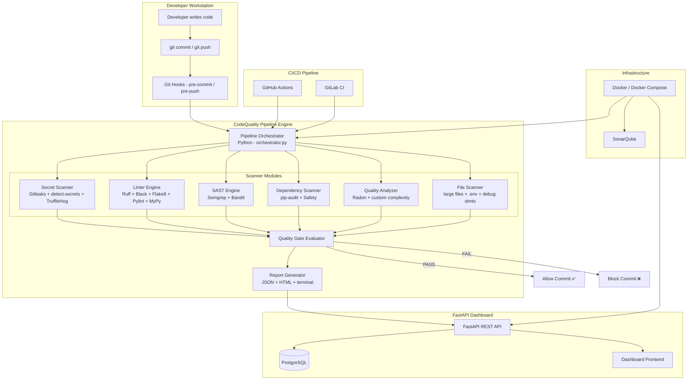
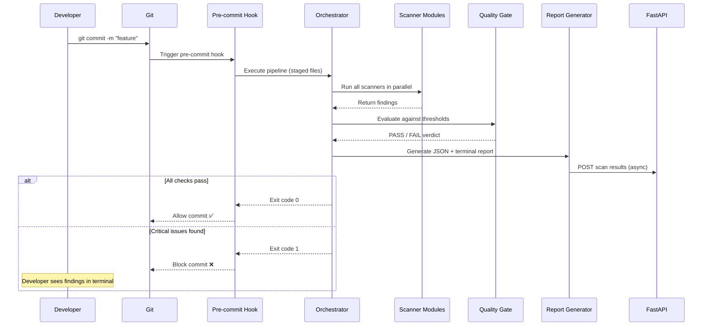
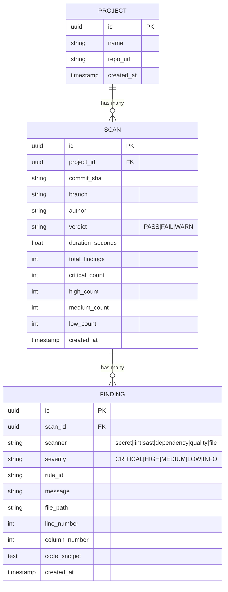

# Enterprise DevSecOps Automated Quality Gate Platform

Build a complete, production-ready, enterprise-grade automated pre-commit security + code quality pipeline system that acts as the **first gate** in a multi-stage CI/CD pipeline.

---

## High-Level Architecture



### Three-Layer Security Strategy

| Layer | Where | Purpose | Speed |
|-------|-------|---------|-------|
| **Local** | Pre-commit hooks | Immediate developer feedback, secret prevention | < 10s |
| **CI/CD** | PR/Merge Request | Enforcement, deeper analysis, dependency scanning | < 5min |
| **Full** | Scheduled / On-demand | Full audit, SonarQube, compliance reports | < 30min |

### Execution Flow



---

## Complete Folder Structure

```
Code-Quality/
├── README.md                           # Project documentation
├── LICENSE                             # License file
├── pyproject.toml                      # Python project config (single source of truth)
├── setup.cfg                           # Legacy tool configs
├── Makefile                            # Developer convenience commands
│
├── config/                             # Centralized configuration
│   ├── pipeline.yaml                   # Main pipeline configuration
│   ├── quality-gates.yaml              # Quality gate thresholds
│   ├── secret-patterns.yaml            # Custom secret detection patterns
│   ├── allowlist.yaml                  # False positive allowlist
│   └── language-profiles/              # Per-language scanner configs
│       ├── python.yaml
│       ├── javascript.yaml
│       └── go.yaml
│
├── src/                                # Main source code
│   └── cqpipeline/                     # Python package: "Code Quality Pipeline"
│       ├── __init__.py
│       ├── __main__.py                 # CLI entry point
│       ├── cli.py                      # CLI argument parsing (Click)
│       │
│       ├── core/                       # Core pipeline engine
│       │   ├── __init__.py
│       │   ├── orchestrator.py         # Main pipeline orchestrator
│       │   ├── config.py               # Configuration loader
│       │   ├── models.py               # Pydantic data models
│       │   ├── exceptions.py           # Custom exceptions
│       │   └── constants.py            # Constants and enums
│       │
│       ├── scanners/                   # Scanner modules (pluggable)
│       │   ├── __init__.py
│       │   ├── base.py                 # Abstract base scanner
│       │   ├── secret_scanner.py       # Secret detection (Gitleaks + detect-secrets)
│       │   ├── lint_scanner.py         # Linting (Ruff + Black + Flake8 + Pylint)
│       │   ├── sast_scanner.py         # SAST (Semgrep + Bandit)
│       │   ├── dependency_scanner.py   # Dependency audit (pip-audit + Safety)
│       │   ├── quality_scanner.py      # Code quality (Radon + complexity)
│       │   ├── file_scanner.py         # File checks (.env, large files, debug stmts)
│       │   └── type_checker.py         # Type checking (MyPy)
│       │
│       ├── gates/                      # Quality gate evaluation
│       │   ├── __init__.py
│       │   ├── evaluator.py            # Gate evaluation engine
│       │   └── policies.py             # Policy definitions
│       │
│       ├── reporters/                  # Report generation
│       │   ├── __init__.py
│       │   ├── base.py                 # Abstract base reporter
│       │   ├── json_reporter.py        # JSON report output
│       │   ├── html_reporter.py        # HTML dashboard report
│       │   ├── terminal_reporter.py    # Rich terminal output
│       │   └── templates/              # HTML report templates
│       │       └── report.html
│       │
│       ├── git/                        # Git integration
│       │   ├── __init__.py
│       │   ├── hooks.py                # Hook management
│       │   └── utils.py                # Git utility functions
│       │
│       └── utils/                      # Shared utilities
│           ├── __init__.py
│           ├── logger.py               # Structured logging
│           ├── process.py              # Subprocess runner
│           └── file_utils.py           # File operations
│
├── api/                                # FastAPI Dashboard Backend
│   ├── __init__.py
│   ├── main.py                         # FastAPI application entry
│   ├── config.py                       # API configuration
│   ├── database.py                     # Database connection (SQLAlchemy async)
│   ├── models/                         # SQLAlchemy ORM models
│   │   ├── __init__.py
│   │   ├── scan.py                     # Scan result model
│   │   ├── finding.py                  # Finding model
│   │   └── project.py                  # Project model
│   ├── schemas/                        # Pydantic request/response schemas
│   │   ├── __init__.py
│   │   ├── scan.py
│   │   ├── finding.py
│   │   └── project.py
│   ├── routers/                        # API route handlers
│   │   ├── __init__.py
│   │   ├── scans.py                    # /api/v1/scans
│   │   ├── findings.py                 # /api/v1/findings
│   │   ├── projects.py                 # /api/v1/projects
│   │   ├── metrics.py                  # /api/v1/metrics
│   │   └── health.py                   # /api/v1/health
│   ├── services/                       # Business logic
│   │   ├── __init__.py
│   │   ├── scan_service.py
│   │   └── metrics_service.py
│   └── migrations/                     # Alembic migrations
│       ├── env.py
│       └── versions/
│
├── hooks/                              # Git hook scripts
│   ├── pre-commit                      # Pre-commit hook (Bash)
│   └── pre-push                        # Pre-push hook (Bash)
│
├── scripts/                            # Automation scripts
│   ├── install.sh                      # One-command installer
│   ├── setup-hooks.sh                  # Git hooks installer
│   ├── run-scan.sh                     # Manual scan runner
│   └── docker-scan.sh                  # Docker-based scan runner
│
├── docker/                             # Docker infrastructure
│   ├── Dockerfile                      # Pipeline scanner image
│   ├── Dockerfile.api                  # FastAPI dashboard image
│   └── docker-compose.yaml             # Full stack compose
│
├── .github/                            # GitHub Actions
│   └── workflows/
│       ├── security-scan.yaml          # PR security scan workflow
│       └── full-audit.yaml             # Scheduled full audit
│
├── .gitlab-ci.yml                      # GitLab CI pipeline
│
├── .pre-commit-config.yaml             # pre-commit framework config
│
├── tests/                              # Test suite
│   ├── __init__.py
│   ├── conftest.py                     # Shared fixtures
│   ├── test_scanners/
│   │   ├── test_secret_scanner.py
│   │   ├── test_lint_scanner.py
│   │   ├── test_sast_scanner.py
│   │   └── test_file_scanner.py
│   ├── test_core/
│   │   ├── test_orchestrator.py
│   │   └── test_config.py
│   ├── test_gates/
│   │   └── test_evaluator.py
│   └── test_api/
│       └── test_scans.py
│
└── docs/                               # Documentation
    ├── architecture.md
    ├── installation.md
    ├── configuration.md
    ├── development.md
    └── troubleshooting.md
```

---

## Proposed Changes (Phased Implementation)

### Phase 1: Core Pipeline Engine

The foundation — scanner framework, orchestrator, configuration system.

---

#### [NEW] [pyproject.toml](file:///c:/Users/ADITYA%20NAIK/Music/Arun%20Mokashi's%20Folder/Code-Quality/pyproject.toml)
- Python project metadata and dependency management
- All tool configurations (Black, Ruff, Pylint, MyPy, pytest) centralized here
- Entry point for `cq-pipeline` CLI command
- Dependencies: `click`, `pyyaml`, `pydantic`, `rich`, `jinja2`, `asyncio`

#### [NEW] [Makefile](file:///c:/Users/ADITYA%20NAIK/Music/Arun%20Mokashi's%20Folder/Code-Quality/Makefile)
- Developer convenience commands: `make install`, `make scan`, `make test`, `make docker-scan`

---

#### [NEW] config/pipeline.yaml
- Master configuration file controlling which scanners are enabled, timeouts, parallelism
- Example: enable/disable individual scanners, set global timeout to 60s, parallel worker count

#### [NEW] config/quality-gates.yaml
- Configurable thresholds: min pylint score (8.0), max cyclomatic complexity (15), max file size (1MB), max function length (50 lines), min test coverage (80%)

#### [NEW] config/secret-patterns.yaml
- Custom regex patterns beyond what Gitleaks provides (org-specific tokens, internal API keys)
- Entropy thresholds for entropy-based detection

#### [NEW] config/allowlist.yaml
- Known false positives, test fixture files, example configs that contain dummy secrets

---

#### [NEW] src/cqpipeline/core/config.py
- YAML config loader using Pydantic `BaseSettings`
- Validates configuration at load time
- Supports environment variable overrides (`CQ_` prefix)
- Merges defaults → project config → env vars (layered config)

#### [NEW] src/cqpipeline/core/models.py
- Pydantic models: `ScanResult`, `Finding`, `Severity` (enum: CRITICAL/HIGH/MEDIUM/LOW/INFO), `ScanVerdict`, `PipelineReport`
- These models are the data contract between all components

#### [NEW] src/cqpipeline/core/orchestrator.py
- Main pipeline engine
- Discovers enabled scanners from config
- Runs scanners in parallel using `asyncio.gather()` with configurable concurrency
- Collects all `ScanResult` objects
- Passes to quality gate evaluator
- Returns final `PipelineReport` with verdict
- Handles timeouts and scanner failures gracefully

#### [NEW] src/cqpipeline/core/exceptions.py
- `ScannerError`, `ConfigurationError`, `QualityGateError`, `TimeoutError`

#### [NEW] src/cqpipeline/core/constants.py
- Severity levels, exit codes, default timeouts, supported languages

---

### Phase 2: Scanner Modules

Each scanner is a pluggable module implementing the `BaseScanner` interface.

---

#### [NEW] src/cqpipeline/scanners/base.py
- Abstract base class `BaseScanner` with:
  - `async scan(files: list[Path], config: ScannerConfig) -> ScanResult`
  - `name` property
  - `supported_languages` property
  - Standard subprocess execution with timeout
  - JSON output parsing

**Design Decision**: Each scanner wraps an external tool (Gitleaks, Bandit, etc.) via subprocess. This keeps the system tool-agnostic — if a better tool emerges, swap the implementation without changing the interface.

#### [NEW] src/cqpipeline/scanners/secret_scanner.py
- **Gitleaks**: Primary secret scanner. Runs `gitleaks detect --source . --report-format json`. Catches AWS keys, GitHub tokens, Stripe keys, JWT, OAuth tokens, DB connection strings, private keys. Uses `.gitleaksignore` for allowlisting.
- **detect-secrets**: Secondary scanner for entropy-based detection. Generates and audits baselines. Catches high-entropy strings that regex might miss.
- **TruffleHog**: Deep git history scanning (CI/CD mode only — too slow for pre-commit). Scans entire git history for rotated/removed secrets.
- Merges and deduplicates findings from all three tools.

**Why three tools**: Each has strengths — Gitleaks is fast and regex-heavy, detect-secrets adds entropy analysis, TruffleHog scans history. Together they provide defense-in-depth.

#### [NEW] src/cqpipeline/scanners/lint_scanner.py
- **Ruff**: Ultra-fast Python linter (replaces Flake8 for speed). Runs `ruff check --output-format json`.
- **Black**: Code formatter check. Runs `black --check --diff`. Reports unformatted files.
- **Pylint**: Deep code analysis with scoring. Runs `pylint --output-format=json`. Enforces minimum score threshold.
- Each tool's findings are normalized to the common `Finding` model.

#### [NEW] src/cqpipeline/scanners/sast_scanner.py
- **Semgrep**: Advanced SAST with community + custom rules. Runs `semgrep scan --config auto --json`. Detects SQL injection, command injection, insecure deserialization, XSS, weak crypto, unsafe subprocess.
- **Bandit**: Python-specific security linter. Runs `bandit -r . -f json`. Detects `eval()`, `exec()`, `yaml.load()`, `pickle.loads()`, `subprocess.call(shell=True)`.
- Normalizes severity mappings between tools.

**Why both**: Semgrep covers multi-language OWASP patterns with custom rules. Bandit is Python-specific and catches Python-unique anti-patterns.

#### [NEW] src/cqpipeline/scanners/dependency_scanner.py
- **pip-audit**: Scans Python dependencies against PyPI advisory database. Runs `pip-audit --format json`.
- **Safety**: Cross-references installed packages against safety-db. Runs `safety check --json`.
- Reports CVE IDs, severity, affected versions, and fix versions.

#### [NEW] src/cqpipeline/scanners/quality_scanner.py
- **Radon**: Cyclomatic complexity analysis. Runs `radon cc . -j` and `radon mi . -j`.
- Custom function-length analyzer (AST-based) — counts lines per function/method.
- Custom class-complexity analyzer.
- Reports functions exceeding complexity thresholds.

#### [NEW] src/cqpipeline/scanners/file_scanner.py
- Detects committed `.env` files (pattern: `**/.env*`)
- Detects large files exceeding size threshold (default: 1MB)
- Detects debug statements: `print()`, `console.log()`, `debugger`, `pdb.set_trace()`, `breakpoint()`
- Detects `TODO`/`FIXME` density above threshold
- Uses Python `pathlib` + `ast` module for detection (no external tools needed)

#### [NEW] src/cqpipeline/scanners/type_checker.py
- **MyPy**: Static type checking. Runs `mypy --json-output`.
- Reports type errors with severity mapping.
- Configurable strictness level.

---

### Phase 3: Quality Gates & Reporting

---

#### [NEW] src/cqpipeline/gates/evaluator.py
- Reads thresholds from `quality-gates.yaml`
- Evaluates findings against policies:
  - **BLOCK**: Any CRITICAL or HIGH severity finding → commit blocked
  - **WARN**: MEDIUM findings → commit allowed with warnings
  - **INFO**: LOW findings → informational only
- Configurable: teams can set their own thresholds
- Returns `ScanVerdict` (PASS/FAIL/WARN) with reasons

#### [NEW] src/cqpipeline/gates/policies.py
- `SecretPolicy`: Zero tolerance for any secret detection
- `SecurityPolicy`: Block on HIGH+ SAST findings
- `QualityPolicy`: Block if pylint score < threshold or complexity > threshold
- `DependencyPolicy`: Block on CRITICAL CVEs, warn on HIGH

---

#### [NEW] src/cqpipeline/reporters/terminal_reporter.py
- Rich terminal output using the `rich` library
- Color-coded findings by severity (🔴 CRITICAL, 🟠 HIGH, 🟡 MEDIUM, 🔵 LOW)
- Summary table with pass/fail per scanner
- Displays file:line for each finding
- Shows total scan duration

#### [NEW] src/cqpipeline/reporters/json_reporter.py
- Structured JSON output for machine consumption
- Includes: timestamp, commit SHA, author, branch, findings, verdict, scan duration

#### [NEW] src/cqpipeline/reporters/html_reporter.py
- Jinja2-templated HTML report
- Severity distribution chart
- Findings table with filtering
- Scanner summary cards
- Saves to `reports/` directory

---

### Phase 4: Git Integration & CLI

---

#### [NEW] src/cqpipeline/cli.py
- Click-based CLI: `cq-pipeline scan`, `cq-pipeline install-hooks`, `cq-pipeline report`
- `scan` subcommand: `--files` (specific files), `--staged` (git staged only), `--all` (full project)
- `install-hooks` subcommand: installs git hooks into `.git/hooks/`
- `report` subcommand: generates HTML report from latest scan

#### [NEW] hooks/pre-commit
- Bash script installed to `.git/hooks/pre-commit`
- Gets list of staged files via `git diff --cached --name-only --diff-filter=ACMR`
- Invokes `cq-pipeline scan --staged`
- Exit code 0 = allow commit, Exit code 1 = block commit

#### [NEW] hooks/pre-push
- Similar to pre-commit but runs deeper scans (dependency audit, TruffleHog history scan)
- Runs on all commits being pushed (not yet on remote)

#### [NEW] .pre-commit-config.yaml
- Configuration for the `pre-commit` framework (alternative hook management)
- Integrates Gitleaks, Bandit, Ruff, Black as individual hooks

---

### Phase 5: FastAPI Dashboard & API

---

#### [NEW] api/main.py
- FastAPI application with versioned API (`/api/v1/`)
- CORS middleware, rate limiting, structured logging
- Lifespan events for DB connection pool management

#### [NEW] api/database.py
- Async SQLAlchemy with PostgreSQL (`asyncpg` driver)
- Connection pooling, session management
- Alembic integration for migrations

#### [NEW] api/models/scan.py
- SQLAlchemy models: `Scan`, `Finding`, `Project`
- `Scan`: id, project_id, commit_sha, branch, author, verdict, duration, created_at
- `Finding`: id, scan_id, scanner, severity, rule_id, message, file_path, line, column

#### [NEW] api/schemas/scan.py
- Pydantic schemas for request/response serialization
- `ScanCreate`, `ScanResponse`, `ScanListResponse`, `FindingResponse`

#### [NEW] api/routers/scans.py
- `POST /api/v1/scans` — Submit scan results
- `GET /api/v1/scans` — List scans with pagination/filtering
- `GET /api/v1/scans/{id}` — Get scan details with findings

#### [NEW] api/routers/findings.py
- `GET /api/v1/findings` — Query findings across scans
- Filter by severity, scanner, file path, date range

#### [NEW] api/routers/metrics.py
- `GET /api/v1/metrics/summary` — Overall security posture
- `GET /api/v1/metrics/trends` — Finding trends over time
- `GET /api/v1/metrics/top-issues` — Most common findings

#### [NEW] api/routers/health.py
- `GET /api/v1/health` — Health check endpoint

> [!NOTE]
> The FastAPI dashboard stores scan results for historical analysis and trend tracking. The pipeline itself works fully offline — the API is optional and receives results asynchronously.

---

### Phase 6: Docker & Infrastructure

---

#### [NEW] docker/Dockerfile
- Multi-stage build: builder stage installs tools, runtime stage is slim
- Installs: Python 3.11, Gitleaks, Semgrep, Bandit, Ruff, Black, pip-audit, Safety, Radon
- Non-root user for security
- Health check included

#### [NEW] docker/Dockerfile.api
- FastAPI dashboard image
- Gunicorn + Uvicorn workers
- Non-root user

#### [NEW] docker/docker-compose.yaml
- Services: `scanner` (pipeline), `api` (FastAPI), `db` (PostgreSQL), `sonarqube` (SonarQube)
- Networks: `backend` (internal), `frontend` (exposed)
- Volumes: persistent data for PostgreSQL and SonarQube
- Environment variable configuration

---

### Phase 7: CI/CD Integration

---

#### [NEW] .github/workflows/security-scan.yaml
- Triggers on: pull_request, push to main/develop
- Jobs: secret-scan, lint-scan, sast-scan, dependency-scan
- Uses the pipeline Docker image
- Uploads SARIF results to GitHub Security tab
- Blocks PR merge on CRITICAL/HIGH findings
- Posts scan summary as PR comment

#### [NEW] .github/workflows/full-audit.yaml
- Scheduled: runs weekly (cron)
- Full project scan including git history
- Generates comprehensive HTML report
- Uploads as GitHub Actions artifact

#### [NEW] .gitlab-ci.yml
- Equivalent GitLab CI pipeline
- Stages: scan, report
- Uses the pipeline Docker image
- Artifacts: JSON and HTML reports

---

### Phase 8: Scripts & Installation

---

#### [NEW] scripts/install.sh
- One-command installer
- Checks prerequisites (Python 3.11+, Git, Docker)
- Creates virtual environment
- Installs Python dependencies
- Installs external tools (Gitleaks, Semgrep)
- Installs git hooks
- Validates installation

#### [NEW] scripts/setup-hooks.sh
- Installs pre-commit and pre-push hooks
- Makes hooks executable
- Validates hook installation

#### [NEW] scripts/run-scan.sh
- Manual scan execution wrapper
- Supports: `--mode local|docker`, `--format json|html|terminal`

---

### Phase 9: Tests & Documentation

---

#### [NEW] tests/conftest.py
- Shared pytest fixtures: temp git repos, sample files with secrets, mock configs

#### [NEW] tests/test_scanners/test_secret_scanner.py
- Tests secret detection with known patterns (AWS key, GitHub token, etc.)
- Tests allowlist functionality
- Tests false positive handling

#### [NEW] tests/test_core/test_orchestrator.py
- Tests parallel scanner execution
- Tests timeout handling
- Tests verdict determination

#### [NEW] docs/architecture.md, installation.md, configuration.md
- Comprehensive documentation

---

## Database Schema (PostgreSQL)



---

## User Review Required

> [!IMPORTANT]
> **Scope Confirmation**: This plan builds ~60 files across the full system. The implementation will be done in phases. Please confirm you want ALL phases implemented, or specify which phases to prioritize.

> [!IMPORTANT]
> **Tool Installation**: External tools (Gitleaks, Semgrep, TruffleHog) require separate installation. The install script handles this, but on Windows, some tools may need manual setup or Docker-based execution. Should I prioritize Docker-based scanning for Windows compatibility?

> [!WARNING]
> **SonarQube**: SonarQube requires a separate server (included in Docker Compose). It adds significant complexity. Should I include full SonarQube integration or defer it to a future phase?

## Open Questions

> [!IMPORTANT]
> **Database Requirement**: The FastAPI dashboard requires PostgreSQL. For local development without Docker, should I include SQLite as a fallback database?

> [!IMPORTANT]
> **JavaScript/TypeScript Support**: You mentioned ESLint/Prettier for JS. Should I implement full JS/TS scanner support now, or focus on Python first and make JS/TS easily addable later via the plugin architecture?

> [!NOTE]
> **Redis/Celery**: You mentioned these as optional. Should I include async task processing with Celery for long-running scans, or keep it simple with `asyncio` for now?

---

## Verification Plan

### Automated Tests
```bash
# Run unit tests
make test

# Run the pipeline against a test repo with intentional issues
make test-integration

# Verify Docker build
docker build -f docker/Dockerfile -t cq-pipeline:test .
docker run cq-pipeline:test scan --help

# Verify API
docker-compose up -d api db
curl http://localhost:8000/api/v1/health
```

### Manual Verification
1. Create a test file with a hardcoded AWS key → verify commit is blocked
2. Create a file with `eval()` → verify SAST finding
3. Create a file with poor pylint score → verify quality gate blocks
4. Run full pipeline → verify HTML report generated
5. Submit results to API → verify dashboard shows data

---

## Scalability Considerations

| Aspect | Strategy |
|--------|----------|
| **Large repos** | Scan only staged/changed files in pre-commit; full scan in CI/CD |
| **Many scanners** | Parallel execution via `asyncio.gather()` with configurable concurrency |
| **Team adoption** | One-command installer, Docker-based execution, gradual threshold rollout |
| **Custom rules** | Plugin architecture — add new scanners by implementing `BaseScanner` |
| **Performance** | Ruff over Flake8 (100x faster), scanner timeouts, caching of unchanged files |
| **Multi-language** | Language profiles in config, scanners declare supported languages |
| **Enterprise** | Centralized config via API, org-wide policy enforcement, audit trail in DB |

---

## Enterprise Best Practices Applied

1. **Defense in Depth**: Three-layer scanning (local → CI/CD → full audit)
2. **Shift Left**: Catch issues at commit time, not in production
3. **Zero Trust for Secrets**: Three independent secret scanners with different detection methods
4. **Configurable Policies**: Organizations can tune thresholds without code changes
5. **Allowlisting**: Proper false-positive management to prevent developer fatigue
6. **Audit Trail**: Every scan result stored in database with commit metadata
7. **Graceful Degradation**: If a scanner tool is not installed, skip with warning (don't block)
8. **Non-root Containers**: Docker images run as non-root user
9. **Structured Logging**: JSON logs for observability integration
10. **SARIF Output**: Standard format for GitHub Security tab integration
